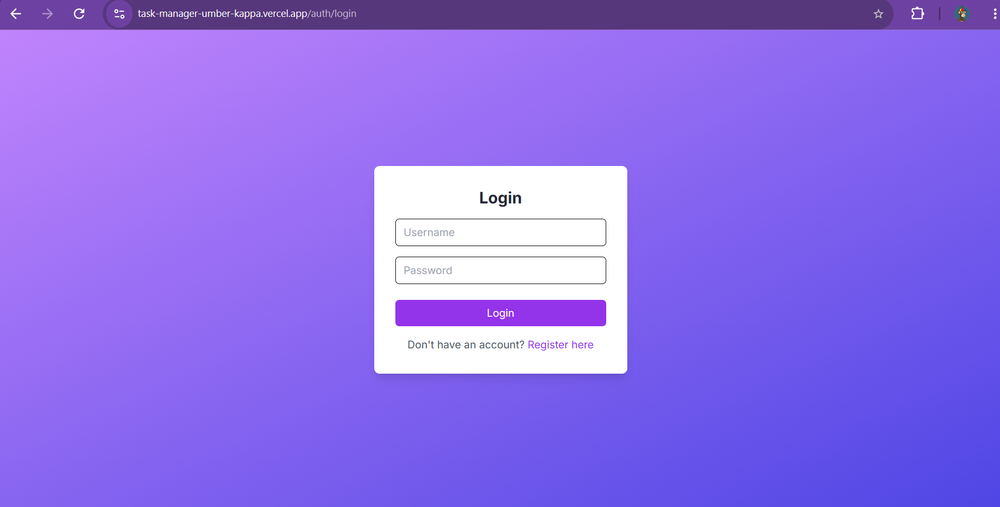
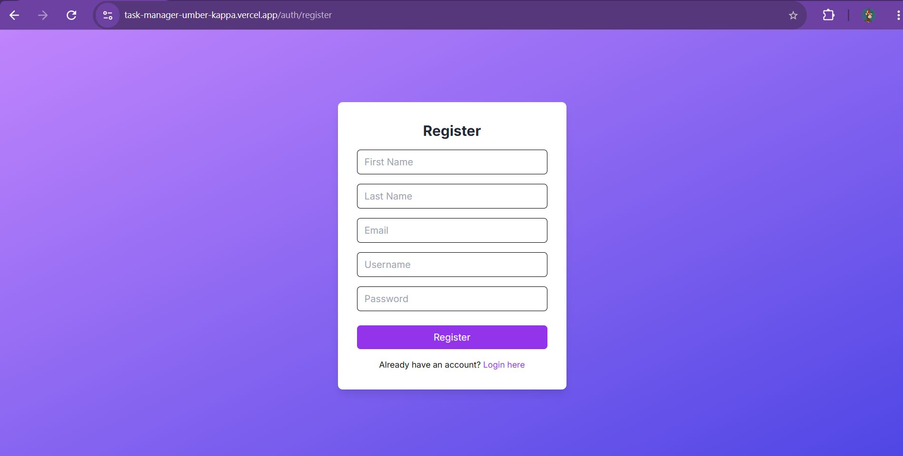
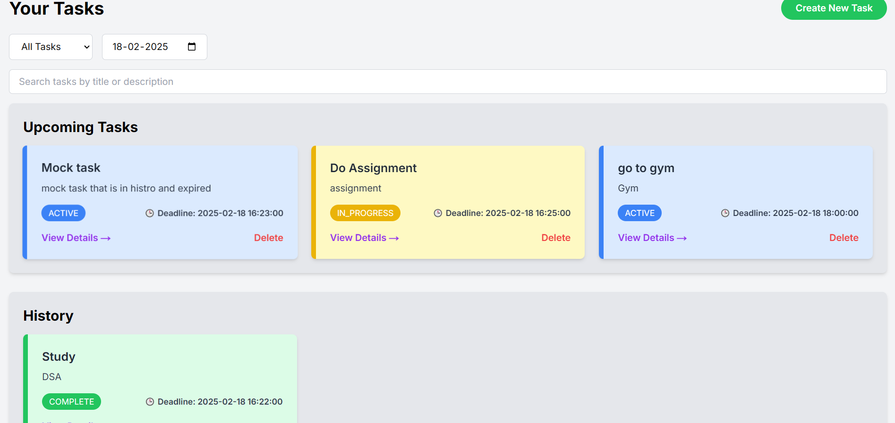
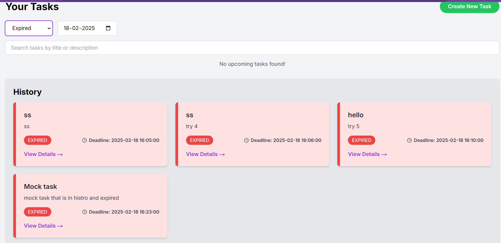
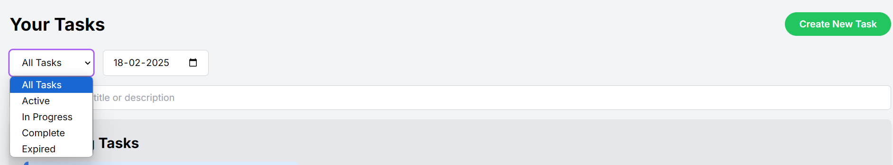
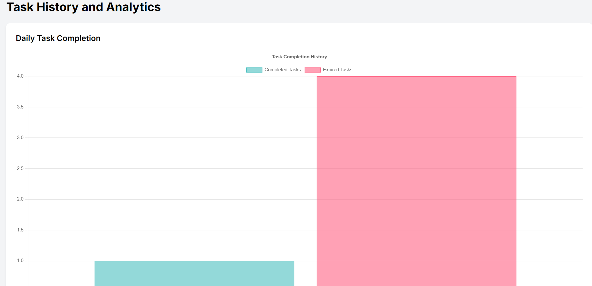
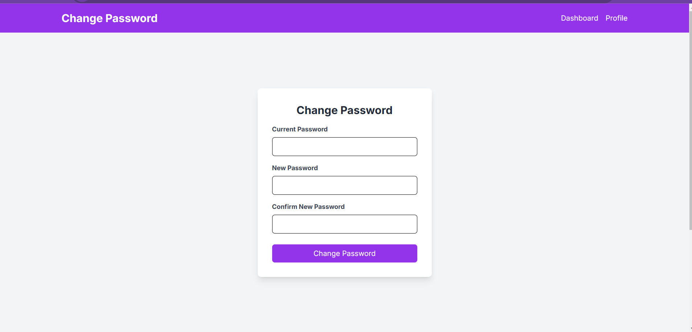
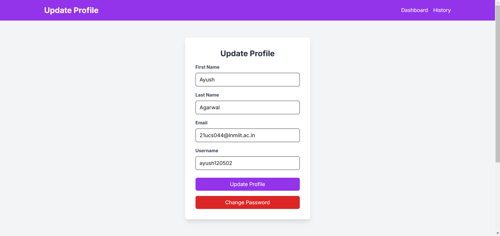

# Task Master - Efficient Todo App  

Task Master is a powerful and efficient Todo application that helps in scheduling and monitoring daily tasks. Built with **Next.js 14**, it allows users to set deadlines, track task progress, and manage their workflow effectively.  

🚀 **Live Demo:** [Task Master Web View](https://task-manager-umber-kappa.vercel.app/)  

---

## 🚀 Features  

- Create, update, and delete tasks  
- Set deadlines for each task  
- Track task status: **ACTIVE, IN PROGRESS, COMPLETED**  
- Automatic task expiration if still ACTIVE after the deadline  
- Secure authentication with JWT and cookies  
- Scheduled cron job for task expiration using **cron-job.org**  
- Interactive analytics and charts with **Chart.js**  

---

## 🏗️ Tech Stack  

- **Framework:** Next.js 14  
- **Database:** MongoDB  
- **Authentication:** bcrypt, jose  
- **State Management:** Cookies  
- **Scheduling:** node-cron  
- **Emails & Notifications:** Nodemailer  
- **UI & Animations:** Framer Motion, Tailwind CSS  
- **Charts & Analytics:** Chart.js  

---


## ⏳ Task Expiration Logic  

- Users can update the task status **only before the deadline**.  
- If a task remains **ACTIVE** after the deadline, it is automatically **expired**.  
- Status **cannot be changed** after expiration.  
- A **cron job** is scheduled at `/api/scheduler` to check and update expired tasks.  

---

## 📸 Screenshots  

Below are some screenshots of the **Task Master** application:

### 🏠 Home Page  
  

### 🔑 Login Page  
  

### 📝 Register Page  
  

### 📊 Dashboard  
  

### ⏳ Expired Tasks  
  

### 🔍 Filters  
  

### 📈 History Analysis  
  

### 🔐 Update Password  
  

### 🏷️ Update Profile  


## 📦 Project Dependencies  

```json
{
  "name": "todo-app",
  "version": "0.1.0",
  "private": true,
  "scripts": {
    "dev": "next dev",
    "build": "next build",
    "start": "next start",
    "lint": "next lint"
  },
  "dependencies": {
    "bcrypt": "^5.1.1",
    "bcryptjs": "^3.0.0",
    "chart.js": "^4.4.7",
    "framer-motion": "^12.4.3",
    "jose": "^5.9.6",
    "mongodb": "^6.13.0",
    "next": "^14.2.24",
    "node-cron": "^3.0.3",
    "nodemailer": "^6.10.0",
    "react": "^18.3.1",
    "react-chartjs-2": "^5.3.0",
    "react-dom": "^18.3.1"
  },
  "devDependencies": {
    "@eslint/eslintrc": "^3",
    "@types/bcryptjs": "^2.4.6",
    "@types/node": "^20.17.19",
    "@types/node-cron": "^3.0.11",
    "@types/nodemailer": "^6.4.17",
    "@types/react": "^19.0.10",
    "@types/react-dom": "^19.0.4",
    "eslint": "^9",
    "eslint-config-next": "15.1.7",
    "postcss": "^8",
    "tailwindcss": "^3.4.1",
    "typescript": "^5.7.3"
  }
}

